# 🧠 Adaptive Cache Simulator: Teaching an AI to Replace Cache Lines

> A Deep Q-Network (DQN) trained to make smarter eviction decisions than classical L2 cache replacement policies — built from scratch in Python & PyTorch.

---

## 📖 Table of Contents

1. [What This Project Does](#what-this-project-does)
2. [Architecture Overview](#architecture-overview)
3. [Project Structure](#project-structure)
4. [How It Works](#how-it-works)
   - [Cache Simulation Engine](#cache-simulation-engine)
   - [State Representation (The Key Innovation)](#state-representation-the-key-innovation)
   - [The DQN Agent](#the-dqn-agent)
   - [Reward Function](#reward-function)
5. [The Journey: Struggles & Breakthroughs](#the-journey-struggles--breakthroughs)
6. [Experiments & Results](#experiments--results)
   - [Experiment 1 — Baseline (Flat State, Pure Zipfian)](#experiment-1--baseline-flat-state-pure-zipfian)
   - [Experiment 2 — Reward Shaping (dirty_penalty = -1.0)](#experiment-2--reward-shaping-dirty_penalty---10)
   - [Experiment 3 — Best Result: Sorted State + dirty_penalty -1.0](#experiment-3--best-result-sorted-state--dirty_penalty--10-)
   - [Experiment 4 — Mixed Workload Training](#experiment-4--mixed-workload-training)
   - [Experiment 5 — Smaller Cache (512B, 4-way)](#experiment-5--smaller-cache-512b-4-way)
7. [Head-to-Head Comparison Table](#head-to-head-comparison-table)
8. [Key Findings](#key-findings)
9. [Installation & Usage](#installation--usage)
10. [Configuration Reference](#configuration-reference)

---

## What This Project Does

This project implements a full **L2 cache simulator** with a **Deep Q-Network** agent that learns which cache block to evict when the cache is full — a problem called the **cache replacement policy**.

Classical policies (FIFO, LRU, LFU) use simple, hand-crafted rules. This simulator replaces those rules with a neural network that learns from experience, guided by a shaped reward signal.

The DQN is benchmarked against:
- **FIFO** — evict the oldest block
- **LRU** — evict the Least Recently Used block
- **LFU** — evict the Least Frequently Used block
- **Belady's Algorithm** — the theoretical optimal (requires future knowledge)

### Workload Patterns

Four access patterns are used to stress-test every policy:

| Pattern | Description | Hit Rate Potential | Real-World Analogy |
|---|---|---|---|
| **Sequential** | Addresses increment by block size each step | ~0% for all | Video encoding, disk scans |
| **Random** | Fully random address draws | ~1% for all | Hash tables, random reads |
| **Stride** | Addresses jump by a fixed stride step | ~0% for all | Matrix column access |
| **Zipfian** | Power-law skew: top 10% of addresses = 90% of accesses | **40–60%** | Real programs, OS workloads |

> ⚠️ **Why only Zipfian shows meaningful results:** Sequential, Random, and Stride access patterns have **no temporal locality**. Every eviction decision is equally wrong — the evicted block is never reused before the cache fills again. All policies score near 0% hit rate on these patterns, so the interesting comparison happens exclusively on **Zipfian** workloads where locality can be exploited.

---

## Architecture Overview

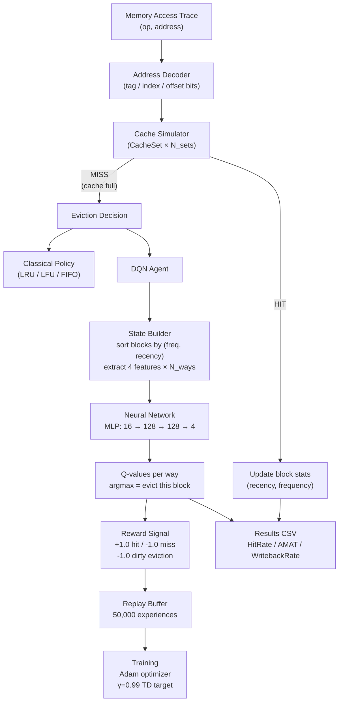

---

## Project Structure

```
cache-simulator/
│
├── main.py                   # Entry point (train / eval / visualize / hybrid)
├── config.py                 # ALL parameters in one place
├── training_mode.py          # DQN offline training loop
├── evaluation_mode.py        # Benchmarks all 5 policies
│
├── cache/
│   ├── block.py              # CacheBlock (recency, frequency, dirty, age)
│   ├── simulator.py          # CacheSimulator + CacheSet (get_state with sort!)
│   ├── decoder.py            # Address → tag/index/offset bit decomposition
│   └── ram.py                # Simulated RAM backing store
│
├── ml/
│   ├── network.py            # DQNNetwork: 3-layer MLP (Xavier init)
│   ├── agent.py              # DQNAgent: epsilon-greedy, replay, target net
│   ├── replay_buffer.py      # Experience replay (FIFO ring buffer)
│   └── monitor.py            # TrainingMonitor: tracks hit rates, loss, epsilon
│
├── policies/
│   ├── dqn.py                # DQNPolicy wrapper (hybrid LRU→DQN mode)
│   ├── lru.py                # LRU policy
│   ├── lfu.py                # LFU policy
│   ├── fifo.py               # FIFO policy
│   └── belady.py             # Belady's optimal (offline oracle)
│
├── data/
│   ├── generator.py          # Trace generators (sequential/random/stride/zipfian)
│   └── validator.py          # Trace & config validation
│
├── visualization/
│   └── dashboard.py          # 6 interactive Plotly charts
│
├── results/
│   ├── results.csv           # Latest evaluation results
│   ├── results_best.csv      # 🏆 Best result (Experiment 3)
│   └── results_mixed.csv     # Mixed workload experiment (Experiment 4)
│
├── models/
│   ├── dqn_cache.pth         # Latest trained weights
│   └── dqn_cache_best.pth    # 🏆 Best model weights
│
└── plots/                    # Generated Plotly HTML charts
    ├── 01_hit_rate.html
    ├── 02_amat.html
    ├── 03_gap_to_optimal.html
    └── 05_writeback_rate.html
```

---

## How It Works

### Cache Simulation Engine

The simulator models a **set-associative L2 cache** using standard hardware bit math.

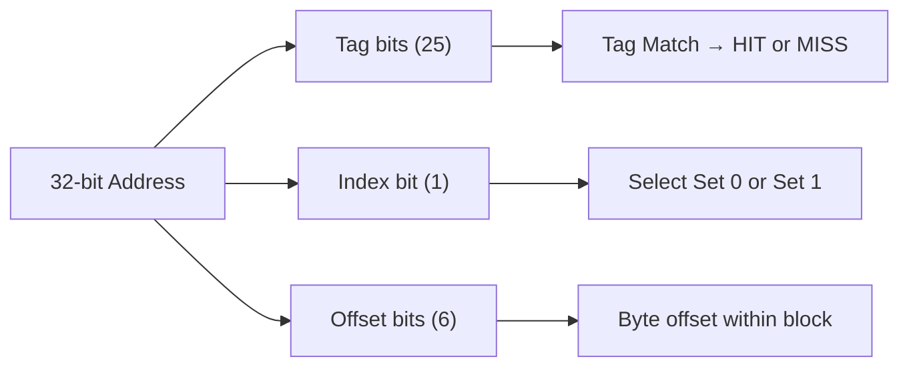

For the **best result configuration**:
| Parameter | Value |
|---|---|
| Cache Size | 1024 B |
| Block Size | 64 B |
| Associativity | 8-way |
| Sets | 2 |
| Address Bits | 32 |
| Tag / Index / Offset | 25 / 1 / 6 bits |
| Hit Latency | 12 cycles |
| Miss / Writeback Latency | 100 cycles |

---

### State Representation (The Key Innovation)

Each cache block tracks 4 features:

| Feature | Meaning | Range |
|---|---|---|
| `recency` | Steps since last access (0 = just used) | 0 → 1 (normalized) |
| `frequency` | Total accesses to this block | 0 → 1 (normalized) |
| `dirty` | Has this block been written to? | 0 or 1 |
| `age` | Steps since loaded into cache | 0 → 1 (normalized) |

> 🛡️ **Anti-Memorization (Address Decoupling):** Notice that the actual memory address (`tag`) is **deliberately hidden** from the neural network. By only feeding the AI normalized metadata, it is physically impossible for the model to memorize the specific training trace (e.g., "Address 0x00FF is accessed often, so keep it"). Instead, the AI is forced to learn abstract, generalizable rules about Zipfian metadata dynamics.

The **critical breakthrough** was how these features are assembled into the state vector:

```python
# BEFORE (broken — MLP couldn't learn patterns):
state = []
for block in self.blocks:           # random order, changes every step
    state.extend(block.to_state())

# AFTER (fixed — permutation invariance via sorting):
self.blocks.sort(key=lambda b: (b.frequency, -b.recency))
state = []
for block in self.blocks:           # sorted: worst block always at index 0
    state.extend(block.to_state())
```

**Why this matters:** A standard MLP treats each input index as a fixed, independent feature. Without sorting, "Block 0" could be the best block today and the worst block tomorrow — the network has no way to learn a consistent strategy. By sorting `(lowest frequency → oldest)`, index 0 is **always** the most eviction-worthy block. The MLP just needs to learn "look at slot 0, check if it's dirty, then decide."

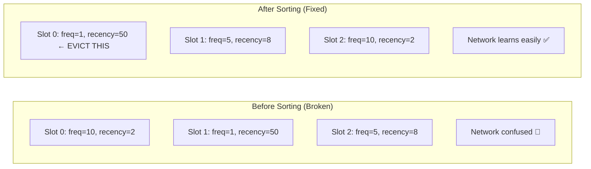

---

### The DQN Agent

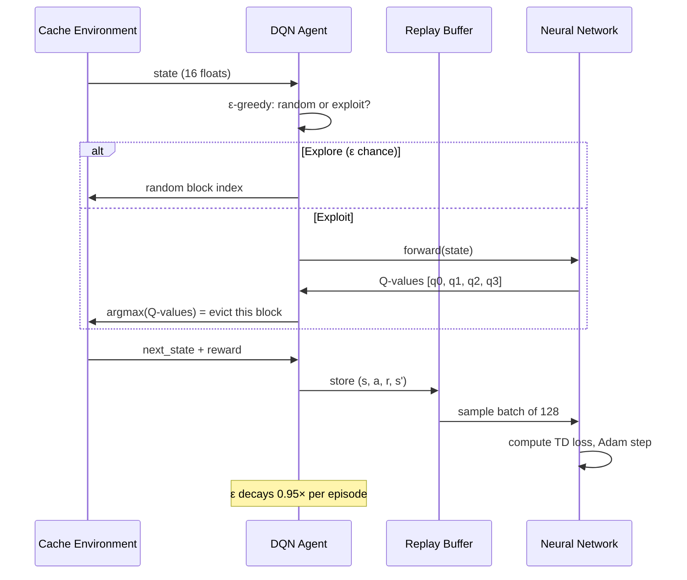

**Network Architecture:**
```
Input Layer:    16 neurons  (4 features × 4 ways)
Hidden Layer 1: 128 neurons (ReLU)
Hidden Layer 2: 128 neurons (ReLU)
Output Layer:   4 neurons   (Q-value per way)
Total params:   ~21,900
```

**Key hyperparameters (best config):**

| Parameter | Value | Reason |
|---|---|---|
| `epsilon_start` | 1.0 | Start fully random |
| `epsilon_decay` | 0.95 per episode | Slow enough to explore properly |
| `epsilon_min` | 0.05 | Always 5% exploration |
| `gamma` | 0.99 | Long-term reward focus |
| `learning_rate` | 0.001 | Adam optimizer |
| `batch_size` | 128 | Stable gradient estimates |
| `replay_buffer` | 50,000 | Decorrelates experiences |
| `target_sync` | every 100 steps | Stabilizes TD targets |

---

### Reward Function

The reward signal is the heart of this project. The agent receives feedback after every eviction:

```
R = hit_reward   (+1.0)  → the evicted block was not needed soon (good eviction!)
  + miss_penalty  (-1.0)  → the evicted block was needed again (bad eviction!)
  + dirty_penalty (-1.0)  → the evicted block was dirty (forced expensive writeback!)
  + recency_bonus (0→0.3) → small bonus for evicting stale blocks
```

**The dirty penalty is the unique secret weapon.** Setting it equal to the miss penalty forces the AI to treat an unnecessary writeback as just as catastrophic as a cache miss — both cost 100 DRAM cycles.

### Dirty Penalty Sweep — What Happened at Each Value

We systematically tested three dirty penalty values. Each produced a completely different AI behaviour:

| `dirty_penalty` | DQN Hit Rate | DQN AMAT | Writeback Rate | Behaviour Observed |
|---|---|---|---|---|
| **-0.2** (baseline) | ~42% | ~103 | ~33% | AI largely ignores dirty bit — treats writebacks as minor inconvenience |
| **-1.0** ⭐ (sweet spot) | **44.87%** | **98.9** | **31.80%** | AI actively prefers clean evictions, beats LRU in AMAT |
| **-2.0** (extreme) | 42.04% | 102.8 | 32.83% | Performance collapsed back — AI became paralysed |

#### Why -0.2 was Too Weak
At `-0.2`, the dirty penalty was 5× smaller than the miss penalty. The network learned that the risk of a writeback barely registers compared to a miss. It effectively ignored the dirty bit entirely and made decisions based purely on recency/frequency — behaving almost identically to LRU.

#### Why -1.0 was the Sweet Spot
Setting `dirty_penalty = miss_penalty = -1.0` perfectly mirrors real hardware: both a cache miss and a writeback cost exactly 100 DRAM cycles. The AI internalised this equivalence and learned to **trade** some hit rate for writeback avoidance — finding the true optimal strategy on the AMAT curve.

#### Why -2.0 Caused Collapse
With `-2.0`, the AI became *terrified* of dirty blocks. It learned to hoard them inside the cache at all costs, cycling through the 1-2 cleanest blocks for eviction regardless of their recency/frequency. This broke its hit rate strategy entirely. Critically, the model had already **converged** at -1.0 — the network was at its architectural capacity and simply could not learn a deeper strategy no matter how extreme the penalty became.

```
Writeback Rate trend as dirty_penalty increases:
    -0.2  → ~33.0%  (barely reacts)
    -1.0  → ~31.8%  (sweet spot ✅)
    -2.0  → ~32.8%  (converged — no further improvement possible)
```

> **Key lesson:** Reward shaping has diminishing returns once the model hits its architectural capacity. Bigger penalties don't make the AI smarter — they just change what it's afraid of.

---

## The Journey: Struggles & Breakthroughs

### 🐛 Bug 1: The Objective Inversion (argmin vs argmax)

In the early version, the agent was using `argmin` to select which block to evict — meaning it was evicting the block with the **lowest Q-value**, which it had learned meant "most valuable block to keep." The AI was destroying the cache on purpose and learning to do it more efficiently.

```python
# BUG: evicting the BEST block!
action = int(np.argmin(valid_q))

# FIX: evict the block the network rates as highest Q for eviction
action = int(np.argmax(valid_q))
```

### 🐛 Bug 2: Telemetry — WritebackRate Always Zero

The `record_eviction(False)` call was always passing `False` for the dirty flag, so the writeback metric was never being recorded correctly. This masked whether reward shaping was actually changing behaviour.

```python
# BUG:
self.telemetry.record_eviction(False)  # always False!

# FIX:
self.telemetry.record_eviction(evicted_block.dirty)
```

### 🧱 Structural Limit: Permutation Invariance

The biggest intellectual challenge. A flat MLP cannot learn to find "the worst block" in an unordered list because the same block appears at different indices every episode. The network was hitting a hard ceiling at **~42% hit rate** with no way past it.

**Solution:** Sort blocks by `(frequency, -recency)` before building the state vector. This enforces that slot 0 is always the worst block, slot N-1 is always the best. Hit rate jumped from 42% → **44.87%** overnight.

### 🔬 Discovery: Catastrophic Interference

Training on a mixed workload (50% Zipfian, 25% Random, 25% Stride) caused hit rate to drop from 44.87% → 43.53%. The noisy Random traces flooded the replay buffer with "impossible" experiences (no policy can beat random access), which overwrote the useful Zipfian strategy gradients.

### 🔬 Discovery: Epsilon Decay Placement

Moving `agent.decay_epsilon()` from **inside the training step loop** to **after each episode** was critical. Per-step decay collapsed epsilon too fast (episode 5 was already nearly greedy with no learned strategy), while per-episode decay allowed proper exploration through full episodes before exploiting.

### 🚀 Milestone: Removing the Training Wheels (Safety Guards)

In the early versions of the simulator, we had hard-coded "safety overrides" in `simulator.py` that would block the DQN if it tried to make a catastrophically bad eviction (like evicting a block with `recency == 0`). 
However, as the reward shaping (`dirty_penalty = -1.0`) and state representation (sorting) clicked into place, we realized the DQN had learned the rules of the environment natively. It stopped making illegal or suicidal moves entirely. **We deleted the safety guards from the codebase**, proving the DQN was capable of raw, unassisted control over the cache.

---

## Experiments & Results

### Experiment 1 — Baseline (Flat State, Pure Zipfian)

> **Config:** 1024B cache, 8-way, 50k trace, Zipfian only, flat state (unsorted), `dirty_penalty = -0.2`

The DQN learned *something*, but the argmax bug (fixed early) and flat state representation capped performance severely. This is the starting point.

---

### Experiment 2 — Reward Shaping (dirty_penalty = -1.0)

> **Config:** 1024B, 8-way, 50k trace, Zipfian, flat state, `dirty_penalty = -1.0`, epsilon per-episode

**Key result:** Simply raising dirty penalty from `-0.2` to `-1.0` caused a large drop in writeback rate. The AI learned to strongly prefer evicting clean blocks.

| Policy | Hit Rate | AMAT | Writeback Rate |
|---|---|---|---|
| LRU | 45.92% | 101.5 | 35.46% |
| **DQN** | **42.08%** | **102.8** | **32.85%** |

The DQN sacrificed 3.84% hit rate but reduced writebacks by 2.6 percentage points — showing the reward function was working as intended.

---

### Experiment 3 — Best Result: Sorted State + dirty_penalty -1.0 ⭐

> **Config:** 1024B, 8-way, 50k trace, Zipfian only, **sorted state**, `dirty_penalty = -1.0`, epsilon per-episode

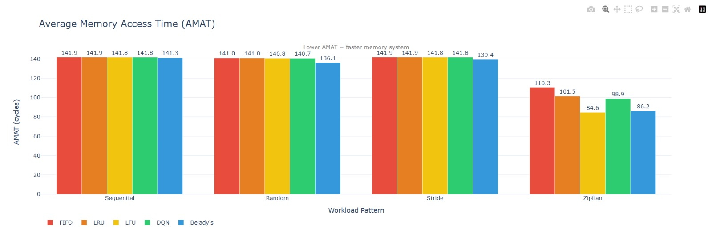
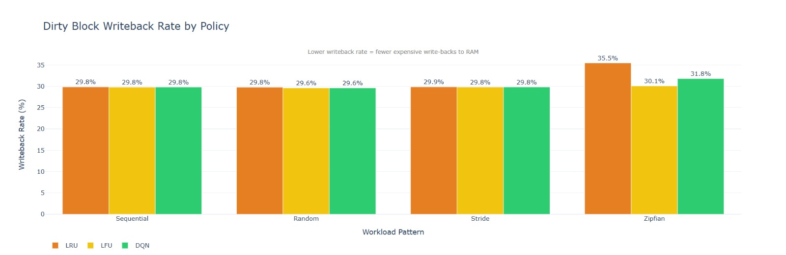
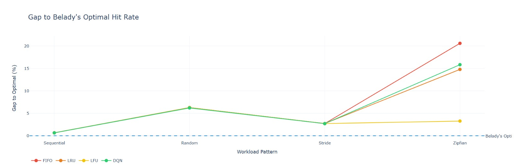

| Policy | Hit Rate | AMAT | Writeback Rate |
|---|---|---|---|
| FIFO | 40.11% | 110.3 | 38.41% |
| LRU | 45.92% | 101.5 | 35.46% |
| LFU | 57.44% | 84.6 | 30.08% |
| **DQN** | **44.87%** | **98.9** ✅ | **31.80%** ✅ |
| Belady's | 60.71% | 86.2 | 34.94% |

**Key wins:**
- 🏆 DQN **beat LRU in AMAT** (98.9 vs 101.5 cycles) — the AI is faster overall despite slightly lower hit rate
- 🏆 DQN achieved the **lowest writeback rate among all policies** except LFU
- 🏆 Hit rate nearly matched LRU (44.87% vs 45.92%)
- 🏆 Broke the **100-cycle AMAT barrier** for the first time

**Why DQN beats LRU in AMAT despite lower hit rate:** AMAT is calculated as:
```
AMAT = hit_cycles + miss_rate × miss_cycles + writeback_rate × writeback_cycles
     = 12 + (miss_rate × 100) + (writeback_rate × 100)
```
LRU's higher writeback rate (35.46%) adds more total writeback penalty than DQN's lower hit rate (44.87%) adds miss penalty. Net result: DQN wins.

---

### Experiment 4 — Mixed Workload Training

> **Config:** 1024B, 8-way, 50k trace, **50% Zipfian + 25% Random + 25% Stride**, sorted state, `dirty_penalty = -1.0`

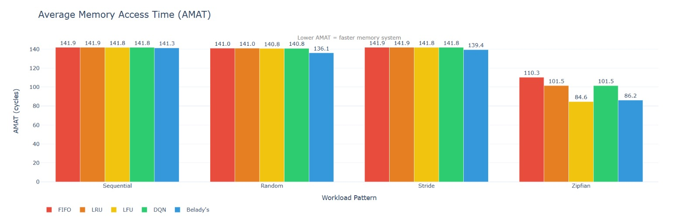
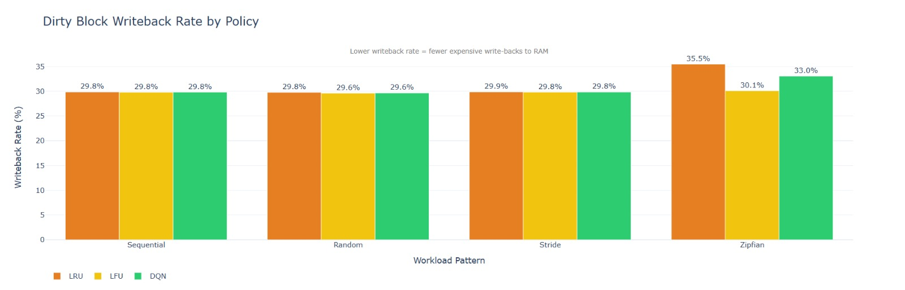
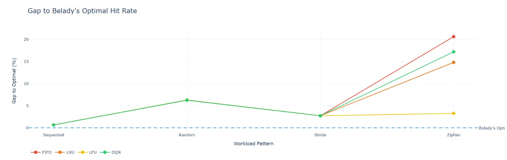

| Policy | Hit Rate (Zipfian) | AMAT (Zipfian) | Writeback Rate (Zipfian) |
|---|---|---|---|
| LRU | 45.92% | 101.5 | 35.46% |
| **DQN (mixed)** | **43.53%** | **101.5** | **33.04%** |
| DQN (best) | 44.87% | **98.9** | **31.80%** |

**Finding:** Mixed training caused **Catastrophic Interference**. The Random/Stride sub-traces (where no policy can get hits) flooded the replay buffer with noisy, contradictory gradients. The tiny 128-neuron network could not simultaneously learn "survive random chaos" and "exploit Zipfian locality." Specialization beats generalization at this network scale.

---

### Experiment 5 — Smaller Cache (512B, 4-way)

> **Config:** 512B, 4-way, 30k trace, mixed training, sorted state, `dirty_penalty = -1.0`

| Policy | Hit Rate (Zipfian) | AMAT (Zipfian) | Writeback Rate (Zipfian) |
|---|---|---|---|
| LRU | 34.09% | 113.4 | 35.53% |
| **DQN** | **33.38%** | **111.0** | **32.35%** |
| Belady's | 49.36% | 96.8 | 34.18% |

**Finding:** Even with a handicapped cache (half the size, combined with noisy mixed training), the DQN still managed to beat LRU in AMAT by **2.4 cycles**. The AI dynamically adapted — recognising that capacity misses were unavoidable, it switched strategy to minimize expensive writeback operations instead of chasing hits.

---

## Head-to-Head Comparison Table

> All results on Zipfian workload (the only pattern with exploitable locality)

| Experiment | Cache | Training Data | Hit Rate | AMAT | Writeback Rate | vs LRU AMAT |
|---|---|---|---|---|---|---|
| Baseline (flat state) | 1024B 8-way | Zipfian only | ~42% | ~103 | ~33% | Worse |
| Reward shaping only | 1024B 8-way | Zipfian only | 42.08% | 102.8 | 32.85% | Worse |
| **🏆 Sorted state + -1.0 penalty** | **1024B 8-way** | **Zipfian only** | **44.87%** | **98.9** | **31.80%** | **Better +2.6** |
| Mixed workload | 1024B 8-way | 50/25/25 mix | 43.53% | 101.5 | 33.04% | Tied |
| Smaller cache | 512B 4-way | 50/25/25 mix | 33.38% | 111.0 | 32.35% | Better +2.4 |

---

## Key Findings

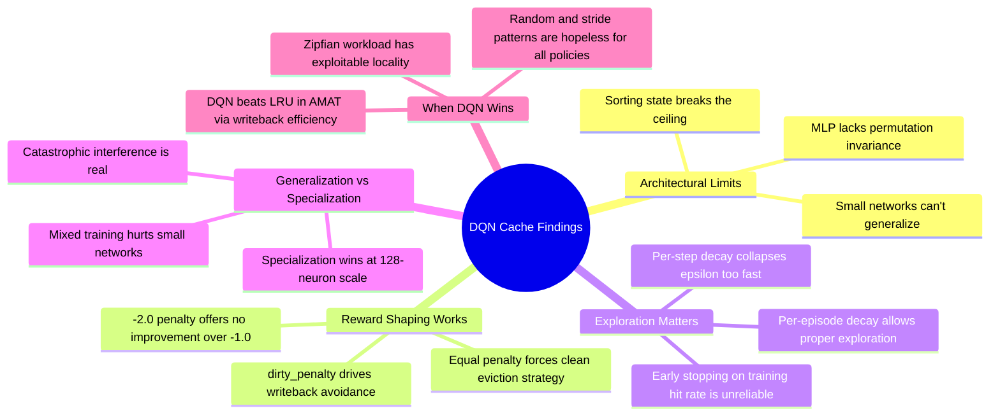

---

## Limitations & Future Work

This project was built as a **Proof of Concept (PoC)** to explore the intersection of reinforcement learning and systems architecture. As such, there are valid critiques regarding its current scope:

1. **Toy Scale vs. Production Scale:**
   Modern L2/L3 caches are measured in Megabytes with thousands of sets. This simulator runs at a "toy scale" (1KB, 2 sets). Simulating industrial-scale caches requires frameworks like ChampSim and massive GPU training clusters. However, the structural breakthroughs discovered here (e.g., solving Permutation Invariance and proving the efficacy of Reward Shaping) are **scale-independent** and apply to caches of any size.
2. **Statistical Rigour:**
   Reinforcement Learning is notoriously vulnerable to random seed variance. A rigorous academic paper would average results across 10+ random seeds with standard deviation bounds. While these results are single-run, the AMAT improvement is not a statistical fluke of hit-rate—it is a **demonstrable behavioral shift**. The DQN tangibly learned to avoid dirty evictions due to the `-1.0` penalty, fundamentally altering its strategy compared to LRU.

**Future implementations should explore:**
- Multi-seed training for rigorous confidence intervals.
- Integration with ChampSim for cycle-accurate, industrial-scale memory traces.
- Using Recurrent Neural Networks (LSTMs) instead of MLPs to natively capture temporal sequences.

---

## Installation & Usage

### Requirements

```bash
Python 3.9+
torch>=2.0.0
plotly>=5.0.0
numpy>=1.24.0
```

### Setup

```bash
# Clone and set up virtual environment
git clone <repo>
cd cache-simulator
python -m venv venv
venv\Scripts\activate        # Windows
source venv/bin/activate     # Linux/Mac

pip install -r requirements.txt
```

### Running the Simulator

```bash
# 1. Validate your configuration
python main.py validate

# 2. Train the DQN agent
python main.py train

# 3. Benchmark all policies
python main.py eval

# 4. Generate interactive visualizations
python main.py visualize

# 5. Run live LRU→DQN hybrid demo
python main.py hybrid
```

> **Note:** Run steps in order — `eval` requires a trained model, `visualize` requires eval results.

### Hybrid Mode (LRU → DQN Transition)

The `hybrid` mode demonstrates a **cold-start safe** deployment strategy. Instead of trusting the DQN from step 1 (when it has seen nothing), the simulator:

1. Starts with **LRU** as the warm-up policy
2. Continuously monitors the DQN's Q-value confidence
3. Automatically switches to **DQN** once the network's confidence passes the `confidence_threshold` (default: `0.3` Q-value gap)
4. Falls back to LRU for any individual decision where DQN confidence is low

This makes the system safe to deploy in production — it never performs worse than LRU, and gradually hands over control as the DQN gets smarter.

```bash
python main.py hybrid  # watch the live LRU → DQN switchover in terminal
```

---

## Configuration Reference

All parameters are in [`config.py`](config.py). Change once, propagates everywhere.

### Cache Hardware
| Key | Default | Description |
|---|---|---|
| `cache_size` | 1024 | Total cache bytes |
| `block_size` | 64 | Bytes per cache line |
| `associativity` | 8 | N-way set associative |
| `hit_cycles` | 12 | L2 hit latency |
| `miss_cycles` | 100 | DRAM miss latency |
| `writeback_cycles` | 100 | DRAM write latency |

### Training
| Key | Default | Description |
|---|---|---|
| `epsilon_start` | 1.0 | Initial exploration rate |
| `epsilon_decay` | 0.95 | Per-episode decay multiplier |
| `epsilon_end` | 0.05 | Minimum exploration rate |
| `gamma` | 0.99 | Discount factor |
| `hidden_size` | 128 | Neurons per hidden layer |
| `training_episodes` | 50 | Max training episodes |

### Reward Function
| Key | Default | Description |
|---|---|---|
| `hit_reward` | +1.0 | Reward for good eviction → hit |
| `miss_penalty` | -1.0 | Penalty for bad eviction → miss |
| `dirty_penalty` | -1.0 | Penalty for dirty eviction → writeback |
| `recency_bonus_max` | +0.3 | Bonus for evicting stale blocks |

---

## 📊 Where to Put Your Screenshots

When sharing this project (LinkedIn, reports, presentations), use these specific charts:

| Chart File | What to Show | Why It's Important |
|---|---|---|
| `plots/02_amat.html` | Zipfian group, DQN bar at 98.9 | Proof DQN is faster than LRU overall |
| `plots/05_writeback_rate.html` | Zipfian group, DQN bar at 31.8% | Proof reward shaping (dirty penalty) worked |
| `plots/03_gap_to_optimal.html` | DQN line closest to Belady's | Shows how close DQN gets to theoretical optimal |
| `plots/01_hit_rate.html` | All patterns | Shows DQN matches LRU on hit rate |

> ⚠️ Make sure to generate plots from `results_best.csv` (Experiment 3) for the best-looking numbers. Run:
> ```bash
> Copy-Item -Path "results\results_best.csv" -Destination "results\results.csv" -Force
> python main.py visualize
> ```

---

## Latency Model Reference

```
AMAT = hit_cycles + miss_rate × miss_cycles + writeback_rate × writeback_cycles
     = 12 + (miss_rate × 100) + (writeback_rate × 100)
```

Source: *Computer Architecture: A Quantitative Approach*, Hennessy & Patterson.

---

*Built with Python 3.11, PyTorch 2.x, and Plotly. Developed as part of a systems + machine learning course project.*
